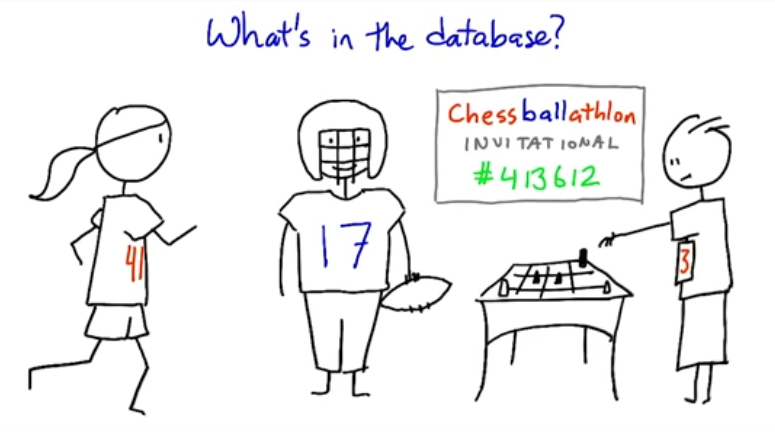

# Tournament Planner

Keep track of available players, registered rivals, and game matches in a multi-tournament arena!  Uses the Swiss-style, non-elimination method to pair up rivals with similar standings.

## Files and Set Up

This Python module uses the PostgreSQL database. (I don't know how others would do it because I don't really understand it, but I'm logged into Vagrant.)

The **tournament.sql** file has the database schema. From the PostgreSQL command line, type `\i tournament.sql` to import the file into psql.
This will:
- drop any previous database called 'tournament'
- create a new one
- connect you to it
- set up the tables and views

The **tournament.py** file stores the Python code for adding, viewing, and fetching data.

The **tournament_test.py** file contains **modified** unit tests that test the functions in tournament.py. The modifications are limited to the input arguments and to a few of the output returns, just enough to make the functions work. 
Run this from the command line, using the command `python tournament_test.py`.

The **test.py** file is my testing ground. It's included in case it's helpful.

## The Database

A few **definitions** for better clarity:
- `game` and `tournament` are used interchangeably.
- A `person` is in the arena but has not registered in any game (yet).
- A `rival` is a person who has registered in a game.

There are 3 tables and 2 views.

**`persons`**
This table lists people present in the arena who are available for playing in a game.
  - `person_id` - the unique id of an available person
  - `person_name` - the person's name; can be a duplicate.

**`registered`**
This table is like a sign-up sheet, matching a person to a game and giving a unique `rival_id`.
  - `rival_id` - the unique id of a tournament-player
  - `person_id` - the person's name
  - `game` - the name of the game (eg. 'bingo')

**`matches`**
This table lists matches played and the outcomes. There can be tied games.
If there is a `bye` game, it is the value of a `win`. A player can only have 1 `bye` per tournament.
  - `game` - the name of the game (eg. 'bingo')
  - `match_id` - the unique id of a single match
  - `rival_lo` - the lower `rival_id` of the two players, or the single id if it's a 'bye' game
  - `rival_hi` - the higher `rival_id` of the two players
  - `lo_status` - the outcome of the match for `rival-lo` (eg. 'won')
  - `hi_status` - the outcome of the match for `rival_hi` (eg. 'lost')
  - `bye` - `true` if it was a 'bye' game, or `null` or `false` if not

**`rival_status`**
This view lists the matches played and the outcomes per rival (instead of per match).
  - `game` - the name of the game (eg. 'bingo')
  - `match_id` - the unique id of a single match
  - `rival_id` - the unique id of a tournament-player
  - `status` - the outcome of a match (eg. 'lost')
  - `bye` - `true`if it was a 'bye' game, or `null` or `false if not.

**`view_standings`**
This table lets you view of the standing per game.
  - `game` - the name of the game (eg. 'bingo')
  - `rival_id` - the unique id of a tournament-player
  - `wins` - the number of wins per person
  - `draws` - the number of draws per person
  - `losses` - the number of losses per person
  - `byes` - the number of byes per person
  - `matches` - the number of matches per person, including 'byes'
  - `name` - the person's name

## Functions in tournament.py

**connect()**
Connects to the PostgreSQL database named 'tournament'. Was part of the template.

**deleteMatches(`game=None`)**
Clears out all the match records from the database for the given game. If no game is given, then all matches for all games are deleted.

**deletePlayers(`player_id=None`)**
Clears out all the 'available persons' records from the database. (ie. all people in arena)

**countPlayers()**
Returns the number of players registered in a game. If a person is registered for two games, they will be counted twice.

**registerPlayer(`name, person_id=None, game=None`)**
Adds a person's name to the arena and/or a tournament. If no `person_id` is given, the name will be added to the `person` table. Conversely, if no `game` is given, the name will not be added to a tournament.

**playerStandings(`game=None`)**
Returns a list of tuples `(rival_id, name, w_l_d_bye, matches)` for each player, sorted by the current standings (wins, byes, draws and then losses that each player has) for the given game. If no input is given, returns the list for all games.

**reportMatch(`game, player, player_status=None, opponent=None`)**
Records the outcome of a single match into the database, including a bye game. If player_status or opponent is 'bye' or None, then the match was a 'bye' game.

**swissPairings(`game=None`)**
Returns a list of similarly-ranking paired rivals, as tuples `(id1, name1, id2, name2)`, giving the ID and name of the paired players for the next round. If there is an odd number of players, the last tuple will be a single player.

### Added Extras

- No rematches between players.
- May have an odd number of players, in which case, one player is assigned a "bye" (skipped round). A bye counts as a free win. A player cannot receive more than one bye in a tournament.
- Draws (tied games) are possible.
- Supports more than one tournament in the database. A "registered player" (a 'person') is different from "a player who has entered in tournament #123" (a 'rival), which required changes to the database schema.

#### Future Additions:

- create teams: instead of player vs player, it'll be team vs team. Different games will have different numbers of players. For example, you'll be able to play tennis in teams of 1, 2, or 4. Once I figure out triggers and sub-sequences.
- create auto-populating tournaments, just because. Better yet, create buttons for the different functions. Like a form to fill out: enter data, click appropriate button and it's in the table. Easy for the end-user. Once I figure out how things link together...

